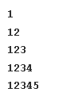
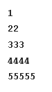
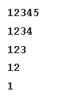
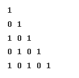
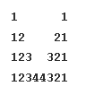
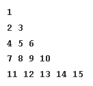
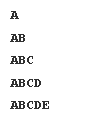
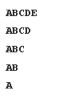
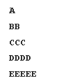

# 🎨 C++ Pattern Programs

**Master loops, nested loops, and logic building with hands-on pattern programs**

---

## 🎯 Pattern Gallery

<table>
  <tr>
    <th>Pattern</th>
    <th colspan="2">Preview</th>
    <th>Code</th>
  </tr>
  <tr>
    <td><strong>P1</strong></td>
    <td colspan="2"></td>
    <td><a href="patterns/p1.cpp">View Code</a></td>
  </tr>
  <tr>
    <td><strong>P2</strong></td>
    <td colspan="2"></td>
    <td><a href="patterns/p2.cpp">View Code</a></td>
  </tr>
  <tr>
    <td><strong>P3</strong></td>
    <td colspan="2"></td>
    <td><a href="patterns/p3.cpp">View Code</a></td>
  </tr>
  <tr>
    <td><strong>P4</strong></td>
    <td colspan="2"></td>
    <td><a href="patterns/p4.cpp">View Code</a></td>
  </tr>
  <tr>
    <td><strong>P5</strong></td>
    <td colspan="2"></td>
    <td><a href="patterns/p5.cpp">View Code</a></td>
  </tr>
  <tr>
    <td><strong>P6</strong></td>
    <td colspan="2"></td>
    <td><a href="patterns/p6.cpp">View Code</a></td>
  </tr>
  <tr>
    <td><strong>P7</strong></td>
    <td colspan="2"></td>
    <td><a href="patterns/p7.cpp">View Code</a></td>
  </tr>
  <tr>
    <td><strong>P8</strong></td>
    <td colspan="2"></td>
    <td><a href="patterns/p8.cpp">View Code</a></td>
  </tr>
  <tr>
    <td><strong>P9</strong></td>
    <td colspan="2"></td>
    <td><a href="patterns/p9.cpp">View Code</a></td>
  </tr>
  <tr>
    <td><strong>P10</strong></td>
    <td colspan="2"></td>
    <td><a href="patterns/p10.cpp">View Code</a></td>
  </tr>
  <tr>
    <td><strong>P11</strong></td>
    <td colspan="2"></td>
    <td><a href="patterns/p11.cpp">View Code</a></td>
  </tr>
  <tr>
    <td><strong>P12</strong></td>
    <td colspan="2"></td>
    <td><a href="patterns/p12.cpp">View Code</a></td>
  </tr>
  <tr>
    <td><strong>P13</strong></td>
    <td colspan="2"></td>
    <td><a href="patterns/p13.cpp">View Code</a></td>
  </tr>
  <tr>
    <td><strong>P14</strong></td>
    <td colspan="2"></td>
    <td><a href="patterns/p14.cpp">View Code</a></td>
  </tr>
  <tr>
    <td><strong>P15</strong></td>
    <td colspan="2"></td>
    <td><a href="patterns/p15.cpp">View Code</a></td>
  </tr>
  <tr>
    <td><strong>P16</strong></td>
    <td colspan="2"></td>
    <td><a href="patterns/p16.cpp">View Code</a></td>
  </tr>
</table>

---

**Happy Learning! Keep coding! 🚀**

